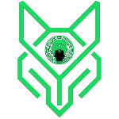
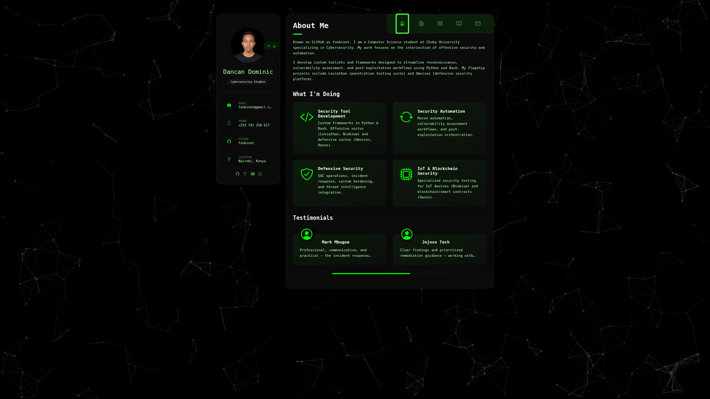
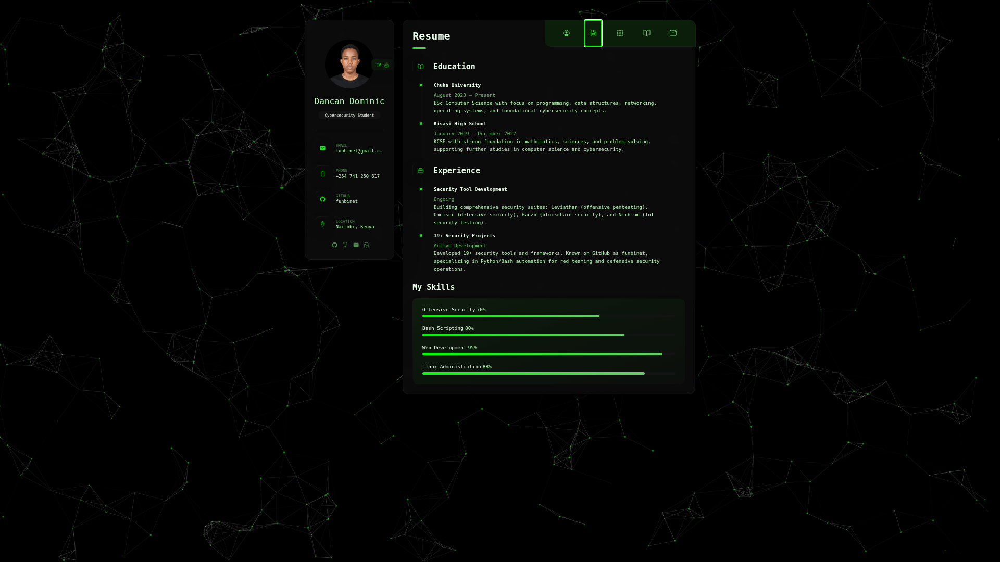
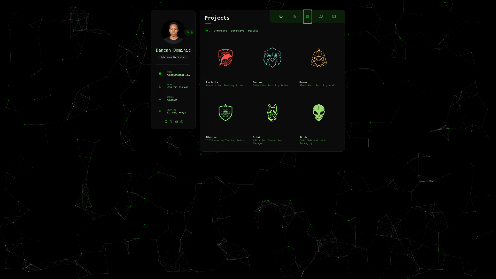
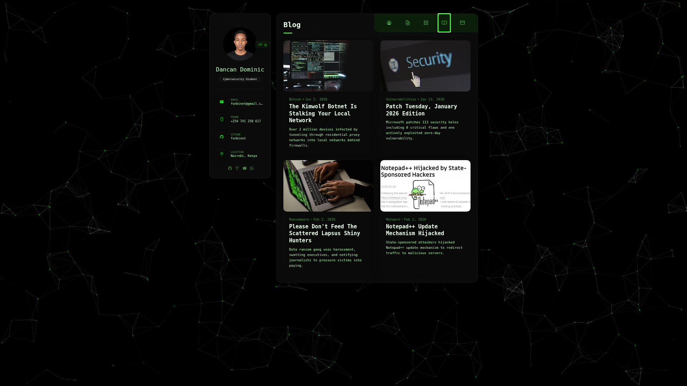

<p align="center">  </p>

<h1 align="center">FUNBINET PORTFOLIO</h1>

<p align="center">
  <b>Modern Cybersecurity-Themed Personal Portfolio with Interactive Particle Background</b>
</p>

<p align="center">
  <strong>Codeberg:</strong> <a href="https://codeberg.org/funbinet">codeberg.org/funbinet</a> • <strong>GitHub:</strong> <a href="https://github.com/funbinet">github.com/funbinet</a> • <strong>License:</strong> Proprietary
</p>

<p align="center">
  <a href="mailto:funbinet@gmail.com">
    
  </a>
  <a href="https://funbinet.vercel.app">
    
  </a>
</p>

---


## Overview

**Funbinet Portfolio** is a modern, feature-rich personal portfolio website designed for cybersecurity professionals and developers. Built with a distinctive hacker green aesthetic and featuring an interactive particle background, it provides a visually striking platform to showcase skills, projects, and professional experience.

The portfolio combines cutting-edge web technologies with a dark terminal-inspired design, creating an immersive experience that reflects the technical nature of cybersecurity work. It serves as both a professional showcase and a demonstration of front-end development capabilities.

---

## Core Purpose

This portfolio addresses the fundamental needs of cybersecurity professionals:

- **Professional Presence**: Establish a strong online identity in the security community
- **Project Showcase**: Display offensive and defensive security tools and research
- **Skills Demonstration**: Highlight technical competencies with visual progress indicators
- **Contact Integration**: Seamless communication through serverless contact forms
- **Mobile Accessibility**: Fully responsive design with PWA installation support

---

## Screenshots

### About Section
Personal introduction with circular avatar, downloadable CV, and social links.

<p align="center">
  
</p>

---

### Resume Section
Education, experience, and technical skills with animated progress bars.

<p align="center">
  
</p>

---

### Projects Section
Featured cybersecurity tools with category filtering and project details.

<p align="center">
  
</p>

---

### Blog Section
Latest cybersecurity articles and industry news.

<p align="center">
  
</p>

---

### Contact Section
Contact form with Google Maps integration and location display.

<p align="center">
  
</p>

---

## Architecture & Design

### Visual Identity
- **Hacker Green Theme**: Primary color `#00fa00` with phosphor green accents
- **Dark Terminal Aesthetic**: Pure black backgrounds with subtle gradients
- **Interactive Particles**: Animated particle background responding to user input
- **Consistent Typography**: Poppins font family for clean, modern text

### Technical Architecture
- **Static Frontend**: Pure HTML5, CSS3, and Vanilla JavaScript
- **Serverless Backend**: Vercel Functions for contact form handling
- **Email Integration**: Resend API for reliable email delivery
- **PWA Support**: Service worker for offline capability and installation

### Performance Optimization
- **Minimal Dependencies**: No heavy frameworks, optimized load times
- **CSS Variables**: Centralized theming for easy customization
- **Lazy Loading**: Efficient resource loading for images and scripts
- **CDN Delivery**: External libraries served from fast CDNs

---

## Key Features

### Interactive Particle Background
- **80 Animated Particles**: Floating green dots with connecting lines
- **Mouse Repulsion**: Particles react and move away from cursor
- **Click Interaction**: Add new particles on mouse click
- **Responsive**: Adapts to screen size and device capabilities

### Skills Visualization
- **Animated Progress Bars**: Visual representation of skill levels
- **Category Organization**: Skills grouped by type (languages, tools, frameworks)
- **Percentage Indicators**: Clear numeric skill ratings

### Project Showcase
- **Category Filtering**: Filter projects by type (Offensive, Defensive, Tools)
- **Project Cards**: Visual cards with descriptions and technology tags
- **External Links**: Direct links to GitHub/Codeberg repositories

### Contact System
- **Serverless Form**: No backend server required
- **Email Validation**: Client and server-side validation
- **Status Feedback**: Real-time form submission status
- **Spam Protection**: Input sanitization and rate limiting

### Progressive Web App
- **Installable**: Add to home screen on mobile devices
- **Offline Support**: Service worker caching for offline access
- **App-like Experience**: Full-screen mode without browser chrome
- **Fast Loading**: Cached assets for instant subsequent visits

---

## Technical Specifications

### Frontend Technologies
- **HTML5**: Semantic markup and accessibility features
- **CSS3**: Custom properties, flexbox, grid layouts
- **JavaScript**: ES6+ with async/await patterns
- **Particles.js**: Interactive background animation library

### Backend Technologies
- **Vercel Functions**: Serverless API endpoints
- **Resend API**: Transactional email service
- **Node.js Runtime**: JavaScript server-side execution

### External Libraries
- **Particles.js**: Background animation (CDN)
- **Ionicons**: Icon library (CDN)
- **ScrollReveal.js**: Scroll animations
- **Google Fonts**: Poppins typography

### Browser Support
- **Modern Browsers**: Chrome, Firefox, Safari, Edge (latest versions)
- **Mobile Browsers**: iOS Safari, Chrome for Android
- **PWA Support**: Chromium-based browsers for installation

---

## Project Structure

```
fun/
├── index.html                    # Main HTML document
├── README.md                     # Project documentation
├── api/
│   └── contact.js                # Serverless contact form handler
└──  assets/
   ├── css/
   │   └── style.css             # Main stylesheet (1800+ lines)
   ├── js/
   │   ├── script.js             # Main JavaScript functionality
   │   └── particles-config.js   # Particle animation configuration
   ├── images/                   # Project and blog images
   └── favicons/                 # PWA icons and manifest
```

---

## Color Palette

| Color Name | Hex Code | Usage |
|------------|----------|-------|
| Hacker Green | `#00FA00` | Primary accent, highlights |
| Muted Green | `#66CC66` | Secondary text, hover states |
| Pure Black | `#000000` | Primary background |
| Near Black | `#0A0A0A` | Card backgrounds |
| Terminal White | `#EAFFEA` | Primary text |
| Phosphor Green | `#B6FFB6` | Subtle highlights |
| Alert Red | `#E63946` | Error states, warnings |

---

## Author Information

**funbinet** is a cybersecurity specialist and penetration tester currently pursuing a Computer Science degree at Chuka University. With expertise in red teaming, penetration testing, and offensive security, funbinet develops comprehensive security solutions and tools.

### Background
- **Education**: Computer Science student at Chuka University
- **Specialization**: Penetration Testing, Red Teaming, Offensive Security
- **Skills**: Python, Bash, JavaScript, C/C++, Kali Linux
- **Philosophy**: "Understanding systems like an attacker, securing them like an engineer"

### Featured Projects
- **LEVIATHAN**: Complete penetration testing suite (100+ tools)
- **OMNISEC**: Comprehensive defensive security platform (80+ tools)

### Contact
- **Email**: funbinet@gmail.com
- **Codeberg**: https://codeberg.org/funbinet
- **GitHub**: https://github.com/funbinet
- **Phone**: +254 741 250 617

---

## License

### Proprietary Software License

Copyright (c) 2026 funbinet

All rights reserved.

This website and its source code are the property of funbinet and are protected by copyright laws and international copyright treaties. No part of this software may be reproduced, distributed, or transmitted in any form or by any means, including photocopying, recording, or other electronic or mechanical methods, without the prior written permission of funbinet.

### Restrictions:

1. **No Redistribution**: You may not redistribute this software, in whole or in part, to any third party.
2. **No Modification**: You may not modify, adapt, translate, reverse engineer, decompile, or disassemble this software.
3. **No Commercial Use**: You may not use this software for commercial purposes without explicit permission.
4. **No Cloning**: You may not clone, fork, or copy this repository or its contents.
5. **No Template Use**: This design may not be used as a template for other projects.

### Disclaimer:

This software is provided "as is" without warranty of any kind, express or implied. funbinet shall not be liable for any damages arising from the use of this software.

### Termination:

This license will terminate automatically if you violate any of these terms and conditions. Upon termination, you must immediately cease all use of the software and destroy all copies in your possession or control.

---

## Viewing the Portfolio

The Funbinet Portfolio is available for viewing at the live website. For inquiries about the design, development approach, or collaboration opportunities, please contact the author directly.

1. **Visit Live Site**: [funbinet.vercel.app](https://funbinet.vercel.app)
2. **Contact Author**: Email funbinet@gmail.com for inquiries
3. **Connect**: Follow on GitHub or Codeberg for project updates

---

<p align="center">
  <b>FUNBINET PORTFOLIO</b> — Cybersecurity Professional Showcase
  <br>
  <small>© 2026 funbinet • Proprietary Software • All Rights Reserved</small>
</p>
